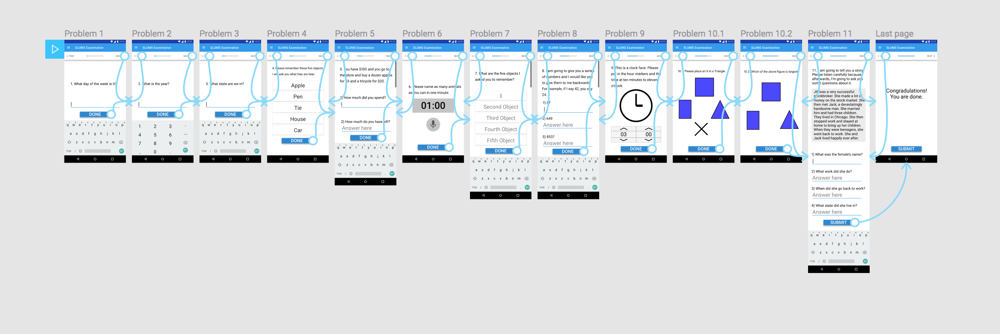
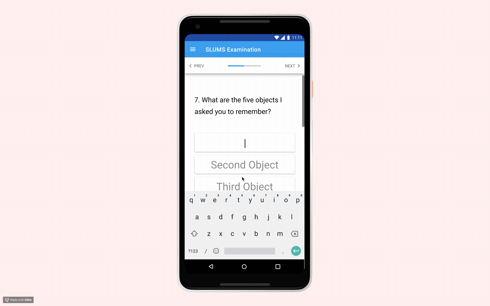
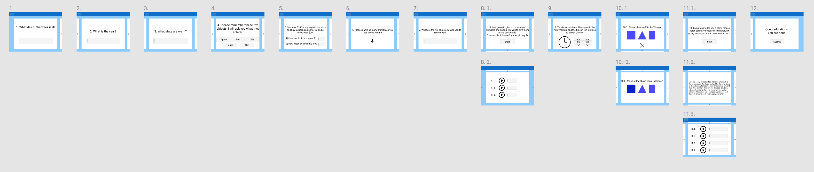
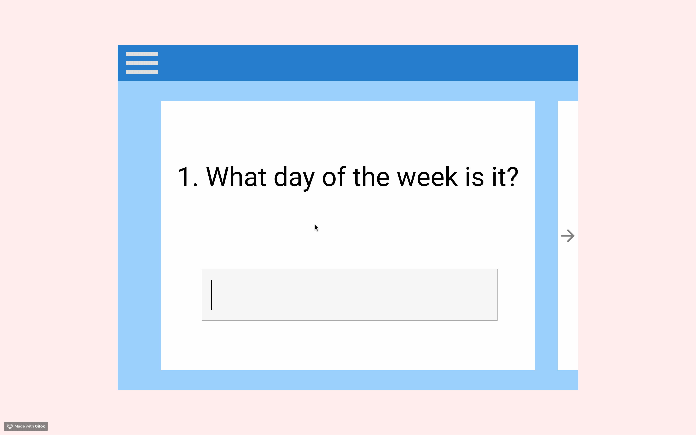

# SLUMS Examination
prototyping application that enables clients to self-conduct SLUMS examination  
  
This prototyping project illustrates translation of written test SLUMS to be self-conductable, so the user can have better understanding of current state without a visit to clinic.  
Multiple core features still needs to be added to the application, but the test presentation being the most important functionality, two iterations of presentation were made for earlier stages of design cycle.  

  
## Android Iteration  
### Problem Flow
  
  
  
### Figma Prototype Demonstration
[Android Prototype Demonstration in Figma](https://www.figma.com/proto/O2pfv6QMRrd9JZn4cyehOlub/Problem-flow-smart-phone?node-id=5%3A739&scaling=scale-down "Come take a look!")
  
  
## iPad Iteration  
### Problem Flow
  
  

### Figma Prototype Demonstration  
This iPad iteration of problem flow incorporates skeumorphism to improve user experience. Each problem has extra layer with colored background to connotate that this problem is a single unit, like how an index card would hold a unit of information. Because the target user of the application will have different background compared to different usergroup, the iPad iteration has strong emphasis to look like a deck of index cards.  

Click the linke below to try the prototype!  
[iPad Prototype Demonstration in Figma](https://www.figma.com/proto/O2pfv6QMRrd9JZn4cyehOlub/Problem-flow?node-id=61%3A847&scaling=min-zoom "Come take a look!")  
  

## Context  
My logic behind the iPad iteration was that because the user of the application will have hard time reading the exam, and they could be handed a tablet to them to take the exam without instructor.  
First draft of the problem flow allowed me to get to think about the conversion, moving the test into a modern portable device.  
Some questions are less obvious as how they should be presented. The big issue is, SLUMS exam has been very carefully crafted by medical professionals to draw guideline for the exam-takers. Therefore, difficulty cannot be jeopardized, modified, or adjusted.  
Therefore, the process required several iterations to make the problem flow as close to the original test, while enabling the user can take the exam alone.
